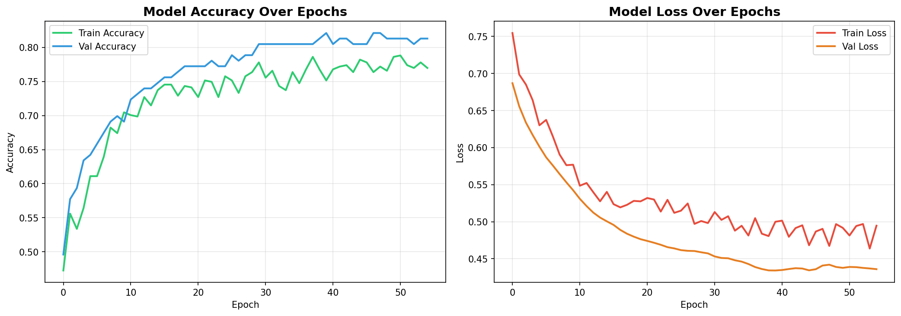
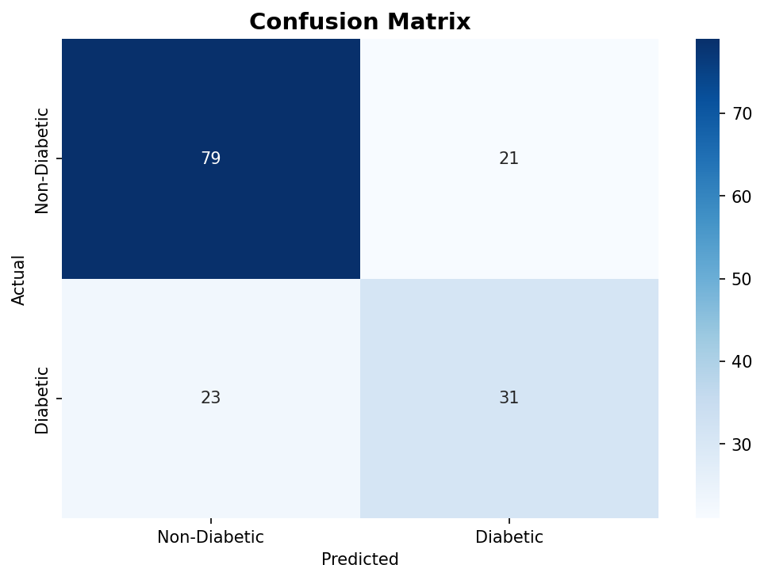

# 🏥 Diabetes Prediction using Neural Network

A Deep Learning model built with TensorFlow & Keras to predict 
diabetes in patients based on medical diagnostic data.

## 📊 Dataset
- **Source**: Pima Indians Diabetes Dataset
- **Samples**: 768 patients
- **Features**: 8 medical indicators
- **Task**: Binary Classification (Diabetic / Non-Diabetic)

## 🧠 Model Architecture
Input (8 features)
↓
Dense Layer (16 neurons, ReLU) + Dropout(0.2)
↓
Dense Layer (8 neurons, ReLU) + Dropout(0.2)
↓
Output Layer (1 neuron, Sigmoid)

## ⚙️ Tech Stack
- Python 3.12
- TensorFlow 2.20.0 / Keras
- NumPy & Pandas
- Scikit-learn
- Matplotlib & Seaborn

## 📈 Results
| Metric | Score |
|--------|-------|
| Test Accuracy | 71.43% |
| Non-Diabetic Precision | 77% |
| Diabetic Precision | 60% |
| True Negatives (Non-Diabetic correct) | 79 |
| True Positives (Diabetic correct) | 31 |

## 📊 Visualizations
### Training History


### Confusion Matrix


## 🔍 Features Used
| Feature | Description |
|---------|-------------|
| Pregnancies | Number of pregnancies |
| Glucose | Plasma glucose concentration |
| BloodPressure | Diastolic blood pressure (mm Hg) |
| SkinThickness | Triceps skin fold thickness (mm) |
| Insulin | 2-Hour serum insulin |
| BMI | Body mass index |
| DiabetesPedigreeFunction | Diabetes hereditary likelihood |
| Age | Age in years |

## 🚀 How to Run
1. Clone the repo
```bash
git clone https://github.com/himasripulapa/diabetes-prediction-neural-network
```
2. Open `diabetes_prediction.ipynb` in Google Colab
3. Run all cells sequentially

## 🏥 Sample Predictions
Patient (Age:50, Glucose:148, BMI:33.6) → DIABETIC 🔴 (59.2%)
Patient (Age:31, Glucose:85,  BMI:26.6) → NON-DIABETIC 🟢 (5.0%)
Patient (Age:25, Glucose:120, BMI:28.5) → NON-DIABETIC 🟢 (13.0%)

## 🔮 Future Improvements
- Apply SMOTE to handle class imbalance
- Improve recall for Diabetic class
- Try Random Forest and XGBoost for comparison
- Deploy as a web app using Flask or Streamlit

## 🎯 Purpose
Built as part of preparation for AI for Healthcare research 
at Jio Institute. Demonstrates practical application of Deep 
Learning in medical diagnosis.

## 👩‍💻 Author
**Pulapa Hima Sri**  
B.Tech CSE — Prasad V Potluri Siddhartha Institute of Technology  
GitHub: [@himasripulapa](https://github.com/himasripulapa)
